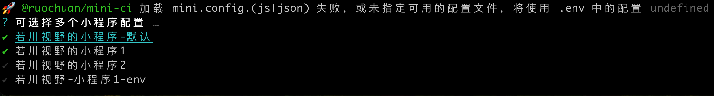

# mini-ci

基于微信小程序 [`miniprogram-ci`](https://developers.weixin.qq.com/miniprogram/dev/devtools/ci.html) 开发的**更快速、更方便（仅需少量配置）且支持多个小程序批量上传等功能**的小程序上传、预览自动化工具

> [npm @ruochuan/mini-ci](https://www.npmjs.com/package/@ruochuan/mini-ci)

[](https://www.npmjs.com/package/@ruochuan/mini-ci)
[](https://codecov.io/gh/lxchuan12/mini-ci)
[](https://npmcharts.com/compare/@ruochuan/mini-ci?minimal=true)
[](https://github.com/lxchuan12/mini-ci/network/members)
[](https://github.com/lxchuan12/mini-ci/stargazers)
[](https://github.com/lxchuan12/mini-ci/watchers)
[](https://github.com/lxchuan12/mini-ci/blob/main/LICENSE)

[miniprogram-ci 官方文档](https://developers.weixin.qq.com/miniprogram/dev/devtools/ci.html)

> 使用 `miniprogram-ci` 前应访问"[微信公众平台](https://mp.weixin.qq.com/wxamp/devprofile/get_profile?token=1680774150&lang=zh_CN) - 开发管理 - 开发设置 - 小程序代码上传"后下载代码上传密钥，一般来说自己使用，可以关闭 IP 白名单，因为 IP 地址可能变。

## 帮助信息 && 上传效果

显示帮助信息

```bash
npx @ruochuan/mini-ci -h
```


支持多个批量上传 -m

```bash
npx @ruochuan/mini-ci upload -m
# 按空格选择多个小程序
```



上传效果


预览效果就是在控制台显示二维码。

## 使用及功能列表

```bash
# 全局安装
npm i @ruochuan/mini-ci -g
# 或者安装到项目中
# npm i @ruochuan/mini-ci -D

# 如果希望实时使用最新版，则可以使用 npx 不全局安装
npx @ruochuan/mini-ci -h
# 注意：版本不同功能可能也不同

# 首次使用时，可以先在小程序项目中，快速初始化配置项
mini-ci init
会把 [miniConfig](https://github.com/lxchuan12/mini-ci/tree/main/packages/mini-ci/miniConfig) 的配置拷贝生成到当前小程序项目（或者新项目）中。

# 查看帮助
mini-ci -h
mini-ci --help

# 查看版本号
mini-ci -v
mini-ci --version

# 或者别名 ruochuan-mini-ci 、rmc
ruochuan-mini-ci --help
rmc --help
```

- [x] 支持快速初始化配置 `mini-ci init`
- [x] 支持上传 `mini-ci upload`
- [x] 支持预览 `mini-ci preview`
- [x] 支持空跑，不执行 `mini-ci upload --dry`
- [x] 支持指定配置文件 `mini-ci --config (xxxx/xxx.js|json)`
- [x] 支持指定参数 如 `robot` 默认是 1，命令：`mini-ci upload --robot 2`
- [x] 支持指定模式读取 `.env` 文件（默认）`mini-ci --mode xxx` 若指定了则是 `.env.[mode]`
- [x] 支持单选多个小程序 `mini-ci upload --useSelect`
- [x] 支持选择多个批量上传 `mini-ci upload --useMultiSelect`
- [x] 支持选择全部的批量上传 `mini-ci upload --useAllConfig`
- [x] `js、json、.env` 配置文件
  - [x] 配置文件支持 js （更灵活更推荐），也支持 json 文件，也支持 `.env`，优先级 `.env` 最低
  - [x] 支持默认读取配置的 json 路径的版本
  - [x] 支持插件 plugins，支持上传、预览前后替换文件 replaceRules
  - [x] 支持默认的版本描述 `desc` 为 `v${version}` - git commit hash - by@${作者}`
  - [x] 支持自定义的 `projectOptions`、`uploadOptions`、`previewOptions` 配置，参考 [`mini.config.js`](https://github.com/lxchuan12/mini-ci/blob/main/packages/mini-ci/mini.config.js) 配置

```bash
参数可以相互结合。
--dry 空跑 (alias：-d)
--robot 2 [ 可选 1-30 ] (alias：-r)
--config (xxxx/xxx.js|json) 指定配置文件  (alias：-c)
# 简单场景 指定模式  默认读取 .env  若指定了则是 .env.[mode]
--mode xxx 指定 .env.[mode]

--useSelect 单选 (alias：-s)
--useMultiSelect 多选批量上传 (alias：-m)
--useAllConfig 选择所有配置批量操作 (alias：-a)
```

## 配置文件

### 首次使用前需先执行 `mini-ci init` 配置 `mini.config.js` 配置（更推荐）

执行 `mini-ci init` 会把 [`miniConfig`](https://github.com/lxchuan12/mini-ci/tree/main/packages/mini-ci/miniConfig) 的配置拷贝生成到当前小程序项目（或者新项目）中。

在当前小程序项目（或者新项目）的目录下配置 `mini.config.js`，这个优先于 `.env`

参考[当前项目中的 `mini.config.js`](https://github.com/lxchuan12/mini-ci/blob/main/packages/mini-ci/mini.config.js)

按照[微信小程序文档](https://developers.weixin.qq.com/miniprogram/dev/devtools/ci.html)配置小程序密钥等，这样就能上传和预览了。如果没有微信小程序，可以自行免费开通个人的[微信小程序](https://mp.weixin.qq.com/)。

### 或者配置 `.env`

在当前小程序项目（或者新项目）的目录下配置 `.env`

参考[当前项目中的 `.env`](https://github.com/lxchuan12/mini-ci/blob/main/packages/mini-ci/.env)

### `configPath` 配置

如果需要单选或者多选时，需配置 `configPath`。

参考 [当前项目中的 `miniConfigList/example.js`](https://github.com/lxchuan12/mini-ci/blob/main/packages/mini-ci/miniConfigList/example.js)

## 关于小程序自动提升版本、打 tag、生成 changelog 等

推荐使用 `release-it`，具体使用方法可以参考 [release-it 官方仓库](https://github.com/release-it/release-it) 或者我的文章 [release-it 自动提升版本、打 tag、生成 changelog 等](https://juejin.cn/post/7124467547163852808#heading-8)。

## 可自行开发

一般不需要自行开发，欢迎 `fork` 提 `PR`，或者加我微信 `ruochuan02` 交流反馈。

```bash
# 克隆我写的 mini-ci 工具
git clone https://github.com/lxchuan12/mini-ci.git
cd mini-ci
pnpm install
# 没有自己的小程序可以克隆腾讯开源的电商小程序
git clone https://github.com/lxchuan12/tdesign-miniprogram-starter-retail.git
# 切到分支 feature/release-it
git checkout feature/release-it
```

可以克隆我的项目，到一个目录中，比如 `projects` 中。

再克隆我的另外一个小程序（腾讯开源的电商小程序），到同一个目录中。比如 `projects` 中。

## TODOs

- [x] 使用 `ES Module` 开发
- [x] 初步引入 `TS`
- [x] 支持 init 快速初始化配置
- [x] 配置文件支持 js （更灵活更推荐），也支持 json 文件
- [x] 支持替换功能，比如替换 url 等
- [x] 支持插件 plugin
- [x] 初步加入测试
- [ ] 校验 nodejs 版本
- [ ] 支持可视化操作

## 原理文章

文章已完成[README-2](./README-2.md)，也已发布在掘金。

[还在用开发者工具上传小程序? 快来试试 miniprogram-ci 提效摸鱼](https://juejin.cn/post/7124467547163852808)

**注意**：文章是基于 [`tag v0.7.0`](https://github.com/lxchuan12/mini-ci/tree/0.7.0) 撰写。后续 `mini-ci` 会持续更新，文章暂时不会更新。

## 与社区已有的工具对比

### Taro 小程序插件 `@tarojs/plugin-mini-ci`

如果使用 `Taro` 开发的小程序，可以直接使用。

具体如何使用参考文档，在这里就不赘述了。

[小程序持续集成 @tarojs/plugin-mini-ci](https://taro-docs.jd.com/taro/docs/plugin-mini-ci/)

我体验下来的感觉有以下几点可以优化。

- 不支持指定机器人
- 不支持不打包时上传
- 不支持官方提供的更多配置
- 不支持选择多个小程序批量上传等等

### uni-app 好像没有提供类似的插件

### 原生 miniprogram-ci 多配置时很麻烦，需要自己开发
